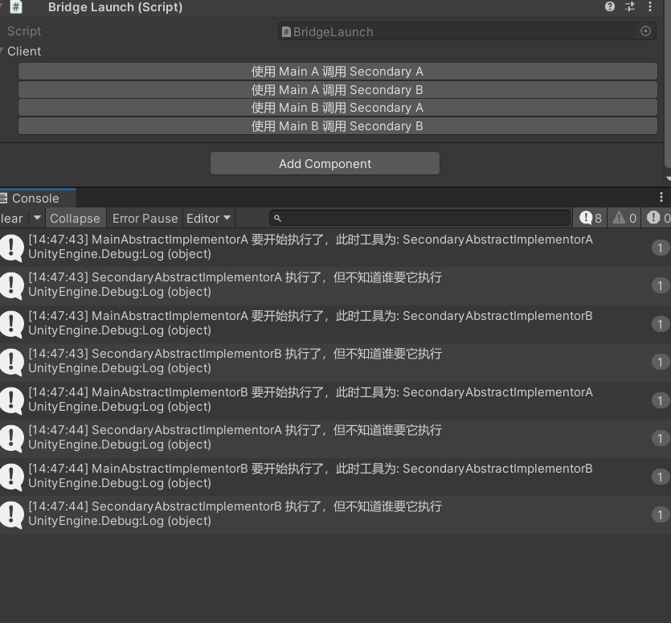
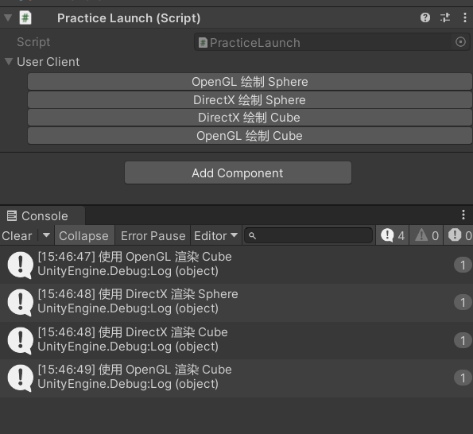

# 桥接模式

## 基础概念

- 将抽象和实现分离，使得二者可以独立的变化
- 简单来说，在编写结构性代码时，尽量使用抽象接口，而不是具体实现

- 桥接模式与中介者模式有点类似
  - 相同点
    - 都是依赖抽象类，将两个或者多个实现类对象可以有行为交互，而不是写在具体实现类中	
  - 不同点
    - 中介者模式主要是两个同一类型的，不同具体实现类，比如原型中的 Colleague 抽象类，两个实现类都属于同一类事物，他们是通过中介者解耦交互行为
    - 桥接模式，通常指的是两类不同事物，有不同的抽象类（每一个抽象类，代表一种事物的共有行为和变量），在两类事物需要进行排列组合的行为时，桥接模式可以将两类事物分隔开，利用抽象类，在中间“桥接”。
    - 中介者模式的实现类对象是同级的，而桥接模式，通常是分级的，分主次的，主要抽象类中，会持有次要抽象类的引用，主要抽象类又可以被外界访问。

## 原型实现

- Main Abstract 主抽象类
- Secondary Abstract 次要抽象类
- Main Abstract Implementor 主抽象类的实现类
- Secondary Abstract Implementor 次要抽象类的实现类
- Client 表示外界去引用主抽象类

---

*<u>**MainAbstract**</u>*

```csharp
namespace YuumiDesignPattern._6_Bridge_Pattern.BasicPrototype.Scripts
{
    public abstract class MainAbstract
    {
        protected SecondaryAbstract SecondaryTool;
        public abstract void Operation();

        public void SetSecondary(SecondaryAbstract secondary)
        {
            SecondaryTool = secondary;
        }
    }
}
```

*<u>**SecondaryAbstract**</u>*

```csharp
namespace YuumiDesignPattern._6_Bridge_Pattern.BasicPrototype.Scripts
{
    public abstract class SecondaryAbstract
    {
        public abstract void DoSomething();
    }
}
```

*<u>**MainAbstractImplementorA**</u>*

```csharp
using UnityEngine;

namespace YuumiDesignPattern._6_Bridge_Pattern.BasicPrototype.Scripts
{
    public class MainAbstractImplementorA : MainAbstract
    {
        public override void Operation()
        {
            var tool = SecondaryTool.GetType();
            Debug.Log("MainAbstractImplementorA 要开始执行了，此时工具为: " + tool.Name);
            SecondaryTool.DoSomething();
        }
    }
}
```

*<u>**MainAbstractImplementorB**</u>*

```csharp
using UnityEngine;

namespace YuumiDesignPattern._6_Bridge_Pattern.BasicPrototype.Scripts
{
    public class MainAbstractImplementorB : MainAbstract
    {
        public override void Operation()
        {
              var tool = SecondaryTool.GetType();
            Debug.Log("MainAbstractImplementorB 要开始执行了，此时工具为: " + tool.Name);
            SecondaryTool.DoSomething();
        }
    }
}
```

*<u>**SecondaryAbstractImplementorA**</u>*

```csharp
using UnityEngine;

namespace YuumiDesignPattern._6_Bridge_Pattern.BasicPrototype.Scripts
{
    public class SecondaryAbstractImplementorA : SecondaryAbstract
    {
        public override void DoSomething()
        {
            Debug.Log($"SecondaryAbstractImplementorA 执行了，但不知道谁要它执行");
        }
    }
}
```

*<u>**SecondaryAbstractImplementorB**</u>*

```csharp
using UnityEngine;

namespace YuumiDesignPattern._6_Bridge_Pattern.BasicPrototype.Scripts
{
    public class SecondaryAbstractImplementorB : SecondaryAbstract
    {
        public override void DoSomething()
        {
             Debug.Log($"SecondaryAbstractImplementorB 执行了，但不知道谁要它执行");
        }
    }
}
```



## 简单实践

- 使用不同的渲染引擎绘制不同物体
- 形状 Shape 抽象类，作为主抽象类
- 渲染引擎 RenderEngine 抽象类，作为次抽象类
- 设计两个形状物体，两个渲染引擎

---



---
